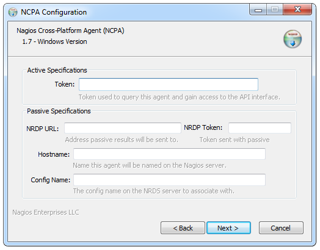

Installation
=================

NCPA is packaged for all of its target platforms, including Windows, Linux RPM and DEB packaging as well as tarballs for some of the less common operating systems. Packaging is the one portion of NCPA that cannot be truly platform agnostic. However, packaging for NCPA allows for quick and easy installation on all target platforms and this documentation will give examples on how to install NCPA.

First and foremost, the following documentation is for a simple install. If you have a complex environment, you can and probably should skip these. What you should know however, is that there are no gotchas involved with installing NCPA.

.. note::

    It is not specified in any of the following instructions, but it is implied that you will may need to adjust your firewall for NCPA as it is using a non-standard port (5693). Generally, Windows will automatically open the port, as will Mac OS. Please keep this in mind as your progress and have it be the first thing that is checked when the initial install does not appear to work.

Installing NCPA on Windows
--------------------------

First, download the installer to the machine that you wish to install NCPA onto. The NCPA installer can be found at `NCPA's Windows Installer link <http://assets.nagios.com/downloads/ncpa/download.php?type=exe&arch=x86>`_.

Graphical Install
+++++++++++++++++

Navigate to the location that the install was downloaded, and double-click the installer. After agreeing to the license terms, you will find the configuration screen. This asks you to fill in some of the pertinent information.

The first thing you will see is the Active Specifications section. **NCPA can be used as an active agent by simply entering a token into the text box and clicking "Next."**  You must remember this token, and enter it when configuring the device within the Nagios XI wizard or using the `check_ncpa.py plugin <http://exchange.nagios.org/directory/Plugins/Network-and-Systems-Management/check_ncpa/details>`_ with Nagios Core. If you are setting up the agent to send passive results back to Nagios, additional information about its specifications, as well as the "Token" field are below.

* **Token** - This is the token that the NCPA agent will use as its form of
  authentication. You will need this token when setting up Nagios to monitor
  this agent.

The following are absolutely not necessary to fill out to get an active agent
up and running on your system. These are for specifying parameters for the
passive agent.

.. glossary::

    NRDP URL
        This is the URL that the NCPA passive agent will send its check results. This is not necessary if you simply want an active agent.

	NRDP Token
		This is the NRDP token used to authenticate the passive checks being sent to Nagios. This is not necessary unless you are sending passive checks with NRDP via the NRDP URL field.

    Hostname
        This is the hostname that the agent will report back to Nagios as and has to be set up within Nagios.

    Config Name
        This is the NRDS config name that the agent will request when contacting the NRDS server.

.. note::

    If you are using pasive checks, the initial install will use the same "NRDP Token" for NRDP and NRDS. If you want to change the value of any of these tokens you will need to edit the ncpa.cfg. See the Configuration section for additional information.

Silent Install
++++++++++++++

The installer also supports a silent install, which is handy if you're one of those ninja systems admins!
There are four specifications currently supported by the NCPA installer, which are all analogues to the directives
in the GUI installer.

.. note::

    The installer will also require a /S flag when installing from the command line in order to install silently.

All of the following are to be used as such::

    /<directive>="<value>"

while being used on the command line. The following are the names of the directives that are available for a silent install.

.. glossary::

    TOKEN
        The token that will be used to access the agent's API and web interface.

    NRDPURL
        This specifies the NRDP URL to use if passive checks are being implemented.

    NRDPTOKEN
	This is the token that will be used to authenticate NRDP passive checks and to authenticate with NRDS.

    HOST
        The host that the passive agent will report back as.

    CONFIG
        The name of the NRDS config the agent will be associated with.

Here is an example of installing silently with the TOKEN 'fishingrocks'::

    ncpa-<version>.exe /S /TOKEN='fishingrocks'

.. note::

    None of the values are set in stone with any installation method and can easily be changed at a later date.
    Also note that the silent install is case sensitive when passing arguments.

Now the NCPA services are installed and started.

To test your installation see `Testing Your Installation`_.

Installing NCPA Using RPM Packing
---------------------------------

First thing that must be done is acquiring the RPM package. The latest RPM package can be found on the Nagios assets site. Please choose the correct package from the following list of RPM-using distributions. Note these are links.

* CentOS 5.x
    * `32-bit <http://assets.nagios.com/downloads/ncpa/download.php?type=rpm&arch=x86&os=el5>`_
    * `64-bit <http://assets.nagios.com/downloads/ncpa/download.php?type=rpm&arch=x86_64&os=el5>`_

* CentOS 6.x
    * `32-bit <http://assets.nagios.com/downloads/ncpa/download.php?type=rpm&arch=x86&os=el6>`_
    * `64-bit <http://assets.nagios.com/downloads/ncpa/download.php?type=rpm&arch=x86_64&os=el6>`_

* CentOS 7.0
    * `64-bit <http://assets.nagios.com/downloads/ncpa/download.php?type=rpm&arch=x86_64&os=el7>`_

* openSUSE 13.x
    * `32-bit <http://assets.nagios.com/downloads/ncpa/download.php?type=rpm&arch=x86&os=os13>`_
    * `64-bit <http://assets.nagios.com/downloads/ncpa/download.php?type=rpm&arch=x86_64&os=os13>`_

.. note:: These RPMs should cover the bases for your systems, if these do not work for your particular system, help make the project better by volunteering for a build or you can checkout the source code from git.

Now that we have our RPM on our system, we simply need to use our package manager
to install it. Many commonly used package managers have the ability to install a
local package. However, in this example we will the rpm command. If you are using
something like *yum* or *zypper* you can use that as well::

    rpm -ivh --nomd5 <path to the NCPA RPM>

Now the NCPA services are installed and started.

You will need to modify /usr/local/ncpa/etc/ncpa.cfg to specify a community
string in the [api] section and set it to your token::

    [api]
    community_string=<your token>

After making changes to the ncpa.cfg, restart the ncpa_listener for the changes
to take affect::

    /etc/init.d/ncpa_listener restart

To test your installation see `Testing Your Installation`_.

Installing NCPA Using DEB Packaging
-----------------------------------

This section is largely the same as the RPM section above. The DEB package must be downloaded to the server you want to monitor, and then it needs to be installed. The latest DEB package is located as follows

* Debian/Ubuntu
    * `32-bit <http://assets.nagios.com/downloads/ncpa/download.php?type=deb&arch=x86>`_
    * `64-bit <http://assets.nagios.com/downloads/ncpa/download.php?type=deb&arch=x86_64>`_

Now that we have the DEB on our system, we simply need to install it. You can
use any package manager you are comfortable with, but for the sake of portability,
this example will use *dpkg* to install this particular package.

To install it, simply use apt-get or dpkg. The following example shows how to
do it with dpkg::

    dpkg -i <path to the NCPA deb>

Now the NCPA services are installed and started.

You will need to modify /usr/local/ncpa/etc/ncpa.cfg to specify a community
string in the [api] section and set it to your token::

    [api]
    community_string=XXXXXX

After making changes to the ncpa.cfg, restart the ncpa_listener for the changes
to take affect::

    /etc/init.d/ncpa_listener restart

To test your installation see `Testing Your Installation`_.

Install NCPA on Mac OS X
------------------------

.. note::

    The install process on Mac OS X is still experimental. If you would like to
    help make this process better, please get in contact with the author
    (whose address can be found at the bottom of the page.)

Download the `DMG here <https://assets.nagios.com/downloads/ncpa/ncpa-head.dmg>`_ .

Download the `NCPA DMG here <http://assets.nagios.com/downloads/ncpa/download.php?type=dmg&arch=x86>`_ . You will need to log in as root, or at least as a user who can run commands as root to continue with the installation. Then, depending on where you installed it (we will assume you downloaded it to your /tmp directory), run the following commands::

    cd /tmp
    hdiutil attach /tmp/ncpa-<version>.dmg
    sudo zsh /Volumes/NCPA-<version>/install.sh

What this script does:

* Creates the folder /usr/local/ncpa if it does not exist
* Moves all necessary files there
* Sets the owner of /usr/local/ncpa to nagios:nagcmd
* Sets the mode of /usr/local/ncpa to 775
* Creates the group nagcmd if it does not exist
* Creates the user nagios if it does not exist
* Starts the listener daemon

If any of this fails, you will need to do the steps manually. The steps that may fail most often are adding users and groups. If they do, add the user 'nagios' and make sure the group 'nagcmd' exists and that 'nagios' user is in the group 'nagcmd'.

Testing Your Installation
-------------------------

.. warning::

    As noted previously at the top of this page, if you get an error when trying
    to access this page immediately after installation, make sure your firewall
    is allowing traffic through on port 5693.

To ensure that installation was successful, try accessing the web interface of
the agent. In order to this you will need to know

* The agent's IP
* The token specified under [api] community_string (This is the *token* field in the Windows Installer)

Once you have these pieces of information you can attempt to connect to the web interface.

::

Where <agent's IP> should be substituted for your agent's IP address. When you access the web interface of NCPA you should be asked to provide the token from above.

This means your installation is working! You can now proceed.
