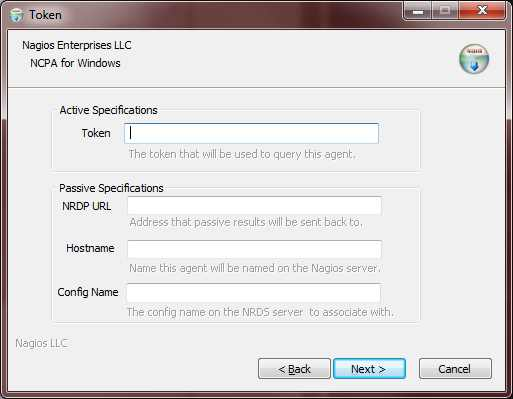

NCPA Installation
=================

NCPA is packaged for all of its target platforms, including Windows, Linux RPM and DEB packaging as well as tarballs for some of the less common operating systems. Packaging is the one portion of NCPA that cannot be truly platform agnostic. However, packaging for NCPA allows for quick and easy installation on all target platforms and this documentation will give examples and on how to install NCPA.

First and foremost, the following documentation is for a simple install. If you have a complex environment, you can and probably should skip these. What you should know however, is that there are no gotchas involved with installing NCPA.

Installing NCPA on Windows
--------------------------

First, download the installer to the machine that you wish to install NCPA onto. The NCPA installer can be found at `NCPA's Windows Installer link <http://assets.nagios.com/downloads/ncpa/ncpa-head.exe>`_. 

Graphical Install
+++++++++++++++++

Navigate to the location that the install was downloaded, and double-click the installer. After agreeing to the license terms, you will find the configuration screen. This asks you to fill in some of the pertinent information.

The first thing you will see is the Active Specifications section. **NCPA can be used as an active agent by simply entering a token into the text box and clicking "Next."**  You must remember this token, and enter it when configuring the device within the Nagios interface.  If you are setting up the agent to send passive results back to Nagios, addtional information about its specifications, as well as the "Token" field are below.

.. glossary::
    
    token
        This is the token that the NCPA agent will use as its form of authentication. You will need this token when setting up Nagios to monitor this agent.

The following are absolutely not necessary to fill out to get an active agent up and running on your system. These are for specifying parameters for the passive agent.

.. glossary::

    NRDP URL
        This is the URL that the NCPA passive agent will send its check results back to. This is not necessary if you simply want an active agent.
    
    Hostname
        This is the hostname that the agent will report back to Nagios as.
    
    Config Name
        This is the NRDS config name that the agent will request when contacting the NRDS server.

Silent Install
++++++++++++++

The installer also supports a silent install, which would definitely be handy if you're a ninja systems admin! There are four specifications currently supported by the NCPA installer, which are all analogs to the directives in the GUI installer.

All of the following are to be used as such::
    
    /*directive* **value**

while being used on the command line. The following are the names of the directives that are available for a silent install.

.. glossary::
    
    NRDP
        This specifies the NRDP URL to use.
    
    TOKEN
        The token that will be used to access the agent's API and web interface.
    
    HOST
        The host that the passive agent will report back as.
    
    CONFIG
        The name of the NRDS config the agent will be associated with.

.. note:: For both install methods, none of the values are set in stone and can easily be changed at a later date.
    
Now the NCPA services are installed and started.

To test your installation see `Testing Your Installation`_.

Installing NCPA Using RPM Packing
---------------------------------

First thing that must be done is acquiring the RPM package. The latest RPM package can be found at `NCPA's RPM link <http://assets.nagios.com/downloads/ncpa/ncpa.i386.rpm>`_. Download this to **the machine you would like to monitor**, do not download this to your personal workstation or your Nagios server.

Using the command line it would look something like this:
::
    
    cd /tmp
    wget http://assets.nagios.com/downloads/ncpa/ncpa.i386.rpm

Now that we have our RPM on our system, we simply need to use our package manager to install it. Many commonly used package managers have the ability to install a local package. However, in this example we will the rpm command. If you are using something like *yum* or *zypper* you can use that as well::
    
    rpm -ivh --nomd5 --nodeps ncpa-head.rpm

Now the NCPA services are installed and started.

To test your installation see `Testing Your Installation`_.

Installing NCPA Using DEB Packaging
-----------------------------------

This section is largely the same. The DEB package must be downloaded to the server you want to monitor, and then it needs to be installed. The latest DEB package is located `NCPA's DEB link <http://assets.nagios.com/downloads/ncpa/ncpa.i386.deb>`_, and we will download it using the command line in this example, however you can download it using your user interface, but just keep in mind where you downloaded it to.

Using the command line it would look something like this:
::
    
    cd /tmp
    wget http://assets.nagios.com/downloads/ncpa/ncpa.i386.deb

Now that we have the DEB on our system, we simply need to install it. You can use any package manager you are comfortable with, but for the sake of portability, this example will use *dpkg* to install this particular package.

.. warning::  For those installing this on a 64-bit Debian-based system, this DEB package is a 32-bit package, for the sake of simplicity. This means that you will need to install the *ia32-libs* package, which is not included in this NCPA distribution, in order to run properly. If there is demand for a 64-bit package, this will be rolled into the NCPA packaging.

::
    
    dpkg -i ncpa.i386.deb

Now the NCPA services are installed and started.

To test your installation see `Testing Your Installation`_.

Testing Your Installation
-------------------------

To ensure that installation was successful, try accessing the web interface of the agent. In order to this you will need to know

* The agent's IP
* The token specified under [api] community_string (This is the *token* field in the Windows Installer)

Once you have these pieces of information you can attempt to connect to the web interface.

::
    
    https://<agent's IP>:5693/api/?token=<token>

Where <agent's IP> and <token> should be substituted for your agent's IP and token, respectively. You should see something that looks like

::
    
    --- snip ---
    {
        "value": {
            "root": {
                "process": [], 
                "user": {
                    "count": 1, 
                    "list": [
                    "nscott"
                    ]
                }, 
                "memory": {
                "swap": {
                "used": [
                    8245542912, 
                    "b"
                ],
    --- snip ---

This means your installation is working! You can now proceed.
